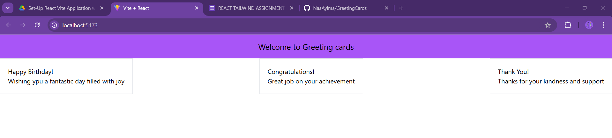

# React + Vite

This template provides a minimal setup to get React working in Vite with HMR and some ESLint rules.

Currently, two official plugins are available:

- [@vitejs/plugin-react](https://github.com/vitejs/vite-plugin-react/blob/main/packages/plugin-react/README.md) uses [Babel](https://babeljs.io/) for Fast Refresh
- [@vitejs/plugin-react-swc](https://github.com/vitejs/vite-plugin-react-swc) uses [SWC](https://swc.rs/) for Fast Refresh

I created a React application called "Greeting Cards" using Vite and Tailwind CSS. Built reusable components like Header, GreetingCard, and App. Learned to set up projects with Vite, style components with Tailwind CSS, and use props to dynamically display content, focusing on clean and modular design.

## output
